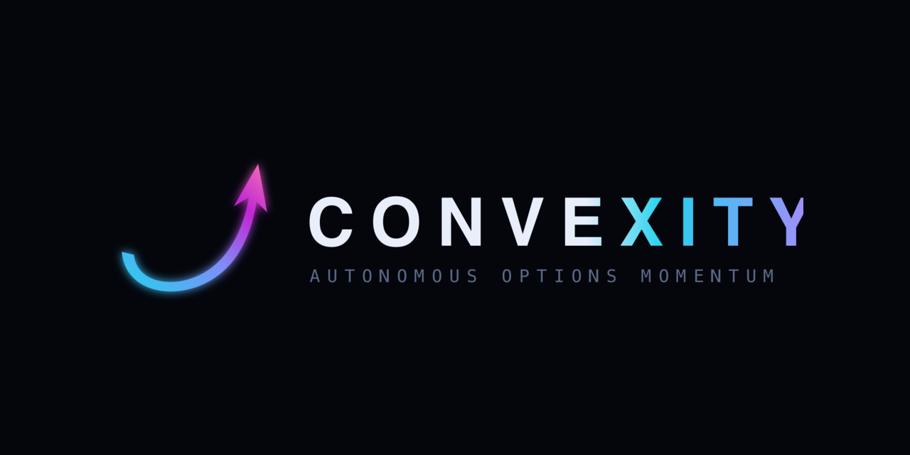
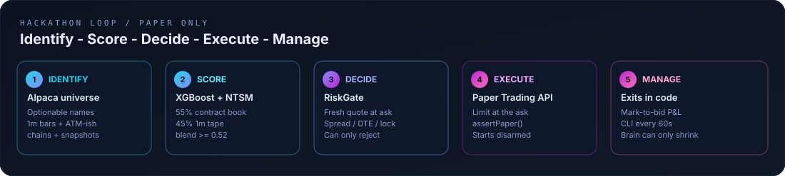
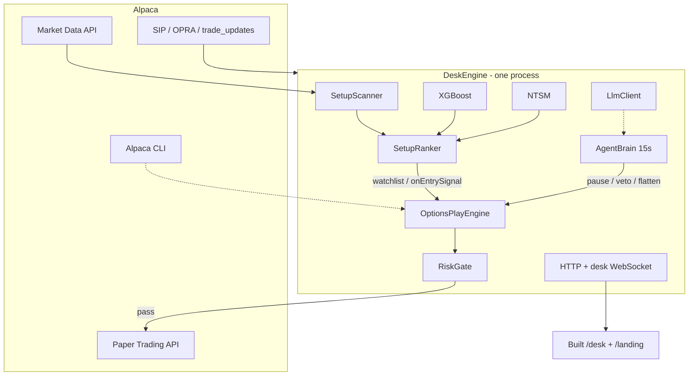
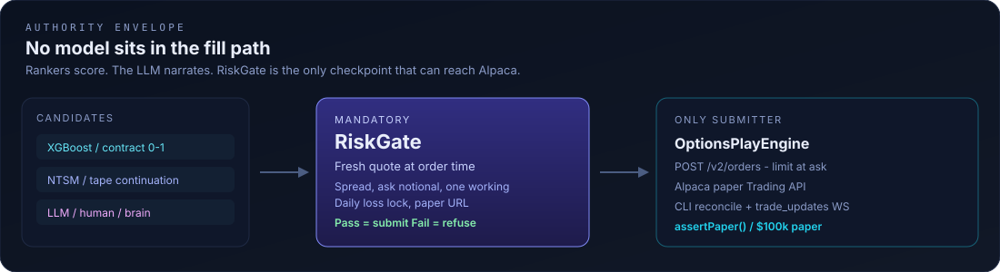
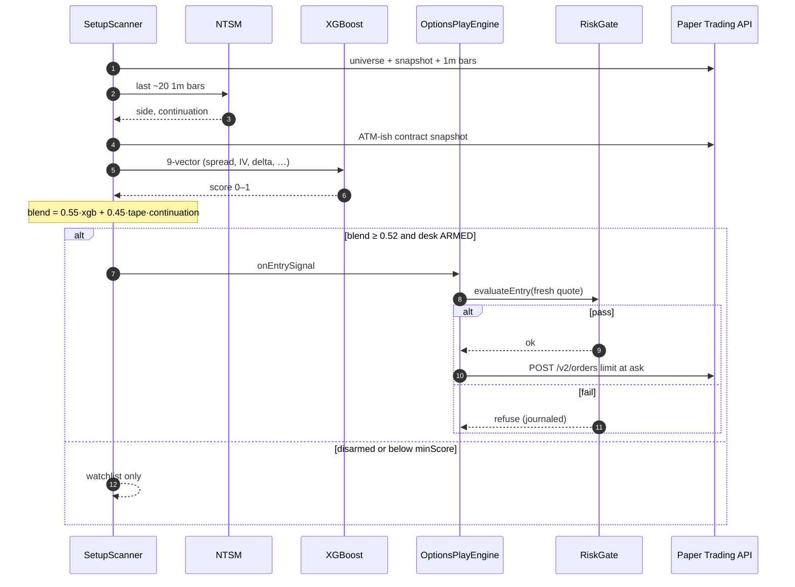
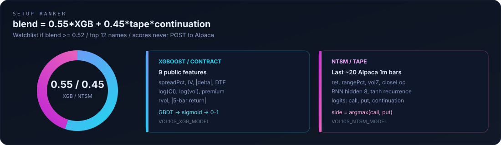
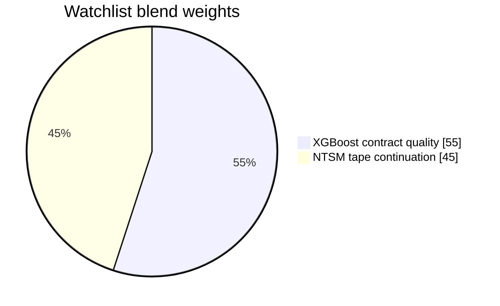
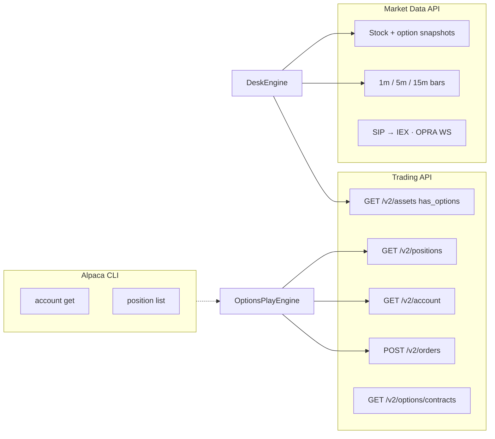
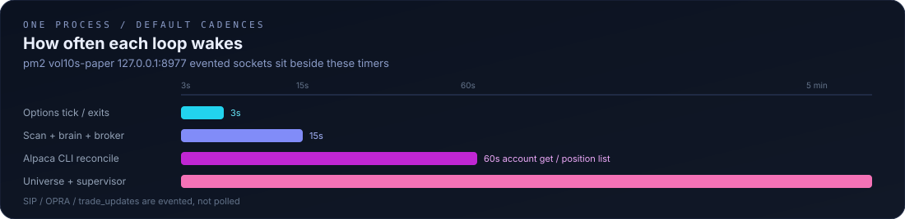

<p align="center">
  
</p>

<h1 align="center">Convexity</h1>

<p align="center">
  <strong>Autonomous Options Alpha Agent</strong><br />
  Alpaca AI Trading Agents Hackathon
</p>

<p align="center">
  <a href="https://convexity.faruqueamin.com/"></a>
  <a href="https://lablab.ai/ai-hackathons/alpaca-ai-trading-agents-hackathon/convexity"></a>
  
  
  
</p>

<p align="center">
  <a href="https://convexity.faruqueamin.com/">Live site</a>
  ·
  <a href="https://lablab.ai/ai-hackathons/alpaca-ai-trading-agents-hackathon/convexity">Team</a>
  ·
  <a href="https://lablab.ai/ai-hackathons/alpaca-ai-trading-agents-hackathon">Challenge</a>
  ·
  <a href="docs/SYSTEM.md">System</a>
  ·
  <a href="docs/hackathon-writeup.md">Write-up</a>
</p>

Convexity is a **single Node process** that runs a paper-trading options desk. It ranks live setups with **XGBoost** (contract book) and **NTSM** (neural time-series over Alpaca 1-minute bars), decides through a mandatory **RiskGate** on a **fresh quote**, executes on Alpaca's **paper Trading API**, and reconciles the street with the **Alpaca CLI**. A 15-second brain can only ever **reduce** risk. **No model sits in the fill path.**

<p align="center">
  
</p>

| Surface | Path |
|---|---|
| Story site | [`/landing/`](https://convexity.faruqueamin.com/landing/) (paper-consent modal + **Revisit consent**) |
| Command desk | [`/desk`](https://convexity.faruqueamin.com/desk) |

---

## Snapshot

| | |
|---|---|
| Process | `src/vol10s-paper-server.js` · pm2 `vol10s-paper` · `127.0.0.1:8977` |
| Account | Alpaca **paper** · $100,000 · **starts disarmed** |
| Data | Alpaca Market Data API + SIP/OPRA sockets — no third-party tape DB |
| Trading | Alpaca Trading API · limit **at the ask** |
| Reconcile | Alpaca CLI `account get` / `position list` every **60s** |
| Rankers | XGBoost 55% · NTSM 45% · watchlist if blend **≥ 0.52** |
| LLM | Pluggable: Ollama Cloud / local Ollama / any OpenAI-compatible host |
| Fill path | `RiskGate` → `OptionsPlayEngine` only |
| Frontend in this repo | **Built** desk + landing only |

---

## Architecture

One box. Rankers feed a watchlist. The engine is the only module that POSTs `/v2/orders`.



Boot: load `envs/vol10s-paper.env` → paper + data clients → `DeskEngine` + engine → pluggable LLM → sockets → listen. SIGINT/SIGTERM stops streams, engines, brain, HTTP.

<p align="center">
  
</p>

---

## Identify → decide → execute → manage

Hackathon plan mapped onto this repo:

| Step | What actually runs | Code |
|---|---|---|
| **Identify** | Optionable Alpaca names, price band **$5–$500**, top volume, nearest-expiry ATM-ish contract | [`SetupScanner`](src/services/vol10s/SetupScanner.js) · [`OptionsClient`](src/services/vol10s/OptionsClient.js) |
| **Score** | XGBoost on the book, NTSM on last ~20 1m bars, blend, keep blend ≥ 0.52, top **12** | [`SetupRanker`](src/services/ml/SetupRanker.js) |
| **Decide** | Fresh-quote RiskGate; brain may pause or veto a symbol | [`RiskGate`](src/services/vol10s/options/RiskGate.js) · [`AgentBrain`](src/services/agent/AgentBrain.js) |
| **Execute** | Limit buy at the **ask** on paper Trading API | [`OptionsPlayEngine`](src/services/vol10s/OptionsPlayEngine.js) · [`PaperAlpacaClient`](src/services/vol10s/PaperAlpacaClient.js) |
| **Manage** | Trail / stop / flatten in **code**; mark-to-bid P&L; CLI every 60s | engine + CLI |

A high score is not a fill. The LLM sits **beside** this pipeline (chat + supervisor). It cannot arm, raise a limit, or place an order unless `trade_enabled` is on **and** RiskGate still passes.



---

## Rankers (swap the files)

<p align="center">
  
</p>

```
blend = xgbWeight · xgb.score  +  (1 − xgbWeight) · tapeScore · ntsm.continuation
```

Default `xgbWeight = 0.55`. `tapeScore` is `callScore` or `putScore` matching NTSM `side`. Rows below **0.52** never reach the watchlist.



| Model | Role | Input | Output | Swap |
|---|---|---|---|---|
| **XGBoost** | Contract quality | 9 public book + tape stats | `{ score ∈ (0,1) }` | `VOL10S_XGB_MODEL` → booster JSON |
| **NTSM** | Tape continuation | Last ~20 Alpaca **1Min** bars | `call` / `put` + continuation | `VOL10S_NTSM_MODEL` |

### XGBoost — 9-vector

GBDT over one option contract. Sum `baseScore` + tree leaves, then `sigmoid`. Prefers tight spreads, moderate delta, weekly (not 0DTE) DTE, listed IV, some size.

| # | Feature | Meaning |
|---|---|---|
| 0 | `spreadPct` | `(ask − bid) / mid × 100` |
| 1 | `iv` | Alpaca greeks or local Black-Scholes |
| 2 | `absDelta` | `\|delta\|` |
| 3 | `dte` | Calendar days to expiry |
| 4 | `logOi` | `log(1 + open interest)` |
| 5 | `logVol` | `log(1 + option volume)` |
| 6 | `premium` | Ask (fallback mid) |
| 7 | `rvol` | Last 1m volume / recent average |
| 8 | `absRet5` | Absolute 5-bar return on the underlying |

Docs: [docs/xgboost.md](docs/xgboost.md)

### NTSM — 4 features × ~20 bars

Compact recurrent net (`h = tanh(Wx x + Wh h + b)`, hidden 8). Three logits → sigmoid: `callScore`, `putScore`, `continuation`. `side` is call if `callScore ≥ putScore`.

| Feature | Formula |
|---|---|
| `ret` | `(close − prevClose) / prevClose` |
| `rangePct` | `(high − low) / low` |
| `volZ` | `(volume − meanVol) / sdVol` |
| `closeLoc` | `(close − low) / (high − low)` |

Docs: [docs/ntsm.md](docs/ntsm.md) · [docs/setup-scanner.md](docs/setup-scanner.md)

---

## RiskGate (every entry)

Same checkpoint for ranker signals, agent `place_option_trade`, and manual buys. Failed checks are **refused**, not resized through.

| Gate | Default |
|---|---|
| Spread | **20%** OPRA · **15%** indicative · **12%** 0DTE (wider 09:30–09:45 ET) |
| Premium band | Ask in **[$0.50, $25]** — priced at **ask**, never mid |
| IV | 0.10–2.0 when greeks exist |
| Delta | `\|delta\| ≥ 0.30` |
| DTE | 1–45 (weekly floor 1; 0DTE off unless `allow0dte`) |
| Notional | `qty × ask × 100 ≤ $2,000` |
| Open premium | Open + working ≤ **$5,000** |
| Daily loss lock | **$2,000** = realized + unrealized, **mark-to-bid** |
| Concurrent | 8 open + working |
| Working orders | **One per symbol** |
| Entries / symbol / day | 3 |
| Cooldown | 120s after cancel / close / reject storm |
| Chase abort | Spread > 30% or pay > mid × 1.35 |
| Paper | URL must be `paper-api.alpaca.markets`; live-looking `AK…` keys refused |

Docs: [docs/risk-gate.md](docs/risk-gate.md)

---

## Alpaca stack

Three channels. Nothing else is the tape.



| Channel | Client | Role |
|---|---|---|
| Trading API | `PaperAlpacaClient` | Paper orders, positions, account, universe |
| Market Data API | `OptionsClient` | Bars (NTSM), snapshots, chains, SIP/OPRA |
| CLI | `alpacaCliEnv` | Read-only whitelist every 60s + agent tool |

Hackathon rule is **MCP or CLI**. This project uses **CLI**. `order create` / `cancel` never pass the whitelist. Child processes get `VOL10S_ALPACA_*` injected so a leftover shell profile cannot leak in.

If SIP is not entitled, bars retry `feed=iex`. If OPRA probe fails, RiskGate uses the **indicative** 15% cap. Missing greeks: local Black-Scholes from mid + spot (`r = 0.043`).

Docs: [docs/alpaca.md](docs/alpaca.md)

---

## Cadence

<p align="center">
  
</p>

| Loop | Cadence | Owner |
|---|---|---|
| Universe refresh | 5 min | `DeskEngine` |
| Rank / scan | **15 s** | `DeskEngine.scanOnce` |
| Broker account sync | 15 s | `DeskEngine.syncBroker` |
| Options engine tick | **3 s** | `OptionsPlayEngine` |
| Exit eval | ~3–5 s | `OptionsPlayEngine` |
| Alpaca CLI | **60 s** | `account get`, `position list` |
| AgentBrain | 15 s | `AgentBrain.tick` |
| Supervisor | 5 min (if on) | `AgentSupervisor` |
| Order + market sockets | evented | `AlpacaOrderWs`, `LiveMarketHub` |

---

## Brain and LLM

**AgentBrain** is deterministic. LLM narration is optional. If the model is down, guards still fire and exits still run.

| Skill | Default |
|---|---|
| Drawdown | Pause entries at 80% of daily loss cap; flatten at 1.25× |
| Liquidity | Veto names that keep failing RiskGate |
| Churn | Pause on cancel / chase storms |
| Exposure | Bound aggregate open premium |
| Consistency | Broker 403 / qty-desync patterns |

Allowed: `pause_entries`, `veto_symbol`, `flatten_all` (hard drawdown), `disarm` (catastrophe flag, default off). **Cannot** arm, raise `maxConcurrent`, or place an order.

### Plug in any model

Hosted desk uses an **Ollama Cloud custom model**. Operators point env at anything that speaks Ollama `/api/chat` or OpenAI `/v1/chat/completions`.

| Provider | `VOL10S_LLM_PROVIDER` | `VOL10S_LLM_BASE_URL` | Model |
|---|---|---|---|
| Ollama local | `ollama` | `http://127.0.0.1:11434` | `llama3.1` (any tag) |
| Ollama Cloud | `ollama` | `https://ollama.com` | your custom id + `VOL10S_LLM_API_KEY` |
| OpenAI-compatible | `openai` | host | OpenAI, Groq, Featherless, OpenRouter, vLLM, … |

### Agent tools (7)

| Tool | Authority |
|---|---|
| `query_stock_metrics` | Read |
| `query_bars` | Read |
| `get_options_screener` | Read |
| `get_option_chain` | Read |
| `get_engine_state` | Read |
| `alpaca_cli` | Read-only whitelist |
| `place_option_trade` | Still goes through **RiskGate** |

Docs: [docs/agent-brain.md](docs/agent-brain.md) · [docs/llm.md](docs/llm.md)

---

## Command desk

Observer (no login): positions, P&L, journal, RiskGate lights, brain, screener, chains.

Admin (password cookie or loopback): arm, flatten, config, agent chat, kill.

| Path | Who | What |
|---|---|---|
| `/` | public | Landing on `convexity.*` hosts; desk on localhost |
| `/landing/*` | public | Built story site |
| `/desk` | observer / admin | Built command desk |
| `GET /api/vol10s-paper/state` | observer | Sanitized snapshot |
| `POST /api/vol10s-paper/arm` | admin | Arm / disarm |
| `GET /api/options/screener` | observer | Chain-volume table |
| `GET /api/brain/state` | observer | Brain journal + skills |
| `POST /api/agent/chat` | admin | LLM chat |
| `POST /api/kill` | loopback | Disarm + flatten |
| WebSocket | both | Live snapshot; observers **cannot** send trade actions |

This repo ships **built** UI only (`desk.min.html` + `public/landing/`). Unminified desk source is gitignored.

Docs: [docs/desk.md](docs/desk.md)

---

## Run

```bash
cp docs/env.example envs/vol10s-paper.env   # paper keys + any LLM
npm install
# optional: alpaca CLI on PATH
pm2 start ecosystem.config.js               # http://127.0.0.1:8977/desk
```

Everything ships **disarmed**. Arm from the desk when you want paper orders.

```bash
# node directly
node src/vol10s-paper-server.js
```

| Env | Purpose |
|---|---|
| `VOL10S_ALPACA_KEY` / `SECRET` | Paper trading |
| `VOL10S_ALPACA_BASE_URL` | Must be `https://paper-api.alpaca.markets` |
| `VOL10S_ALPACA_DATA_URL` | `https://data.alpaca.markets` |
| `VOL10S_ALPACA_CLI` | `true` to reconcile with CLI |
| `VOL10S_LLM_*` | Provider, URL, model, key |
| `VOL10S_XGB_MODEL` / `VOL10S_NTSM_MODEL` | Swap rankers |
| `VOL10S_ADMIN_PASSWORD` | Desk login (blank = loopback operator only) |

Full template: [docs/env.example](docs/env.example) · [docs/config.md](docs/config.md)

Keys live in `envs/vol10s-paper.env` (gitignored). Runtime state under `data/vol10s-paper/` (gitignored).

---

## Repo map

| Path | What |
|---|---|
| `src/vol10s-paper-server.js` | Process entry |
| `src/services/ml/` | XGBoost, NTSM, blend |
| `src/services/vol10s/` | Desk, scanner, engine, RiskGate, Alpaca clients |
| `src/services/llm/` | Pluggable LLM |
| `src/services/agent/` | Brain, tools, supervisor |
| `src/services/vol10s/public/` | Built desk + landing |
| `docs/` | One page per subsystem |
| `brand/` | Mark, lockup, README diagrams |
| `ecosystem.config.js` | pm2 |

---

## Docs

| Document | Covers |
|---|---|
| [SYSTEM.md](docs/SYSTEM.md) | End-to-end architecture, authority, process map |
| [xgboost.md](docs/xgboost.md) | Contract GBDT |
| [ntsm.md](docs/ntsm.md) | Neural 1m tape ranker |
| [setup-scanner.md](docs/setup-scanner.md) | Universe → watchlist |
| [risk-gate.md](docs/risk-gate.md) | Pre-trade checkpoint |
| [execution.md](docs/execution.md) | Fills, exits, CLI |
| [agent-brain.md](docs/agent-brain.md) | 15s observe → act |
| [llm.md](docs/llm.md) | Plug any model |
| [alpaca.md](docs/alpaca.md) | Trading API, data, CLI |
| [desk.md](docs/desk.md) | HTTP / WS / consent |
| [config.md](docs/config.md) | Environment |
| [hackathon-writeup.md](docs/hackathon-writeup.md) | One-page submission |

---

Paper trading is a simulation. Results are hypothetical and do not represent actual trading. Options involve substantial risk. See [Alpaca disclosures](https://alpaca.markets/disclosures).
